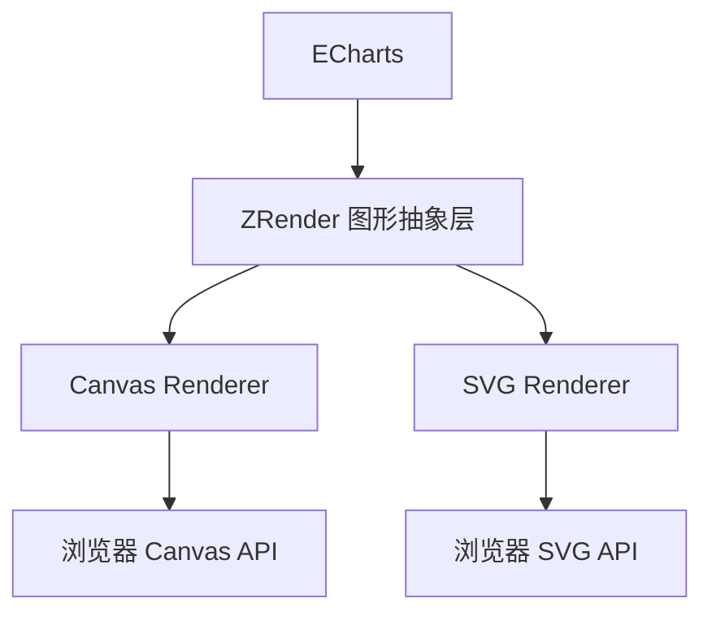

# ZRender核心原理剖析

## 定义与定位

ZRender（Zlevel Render）是 ECharts 的底层渲染引擎，由百度团队开发的轻量级 Canvas/SVG 抽象层。其核心作用：统一图形元素的描述与渲染逻辑，实现跨渲染器的一致性 API。

## 核心功能

+ 图形系统

  + 提供 Group（容器）、Shape（基础图形）等抽象对象
  + 内置 Circle、Rect、Path 等 20+ 种图形类型

```javascript
// ZRender 绘制示例
const zr = zrender.init(document.getElementById('main'));
const circle = new zrender.Circle({
  shape: { cx: 100, cy: 100, r: 50 },
  style: { fill: 'red' }
});
zr.add(circle);
```

+ 渲染调度

  + 自动脏区检测（仅重绘变化区域）
  + 分层渲染（通过 zlevel 控制绘制顺序）

+ 事件系统

  + 实现跨渲染器的标准化事件模型
  + 支持命中检测（Canvas 模式下的元素事件）

### 架构价值

+ 跨平台能力：同一份图形描述可输出到 Canvas/SVG/VML（兼容 IE8）

+ 性能优化：

  + 增量渲染（避免全量重绘）

  + 复合图层技术（减少 GPU 纹理切换）

+ 扩展性：允许开发者通过自定义 Shape 扩展图形类型

## ECharts 与 ZRender 的关系



工作流程：

1. ECharts 将 option 转换为 ZRender 的图形树
2. ZRender 根据配置选择渲染器（Canvas/SVG）
3. 调用对应渲染器的底层 API 进行绘制

## 实际开发建议

+ 渲染器切换方法

```javascript
// 初始化时指定渲染器
const chart = echarts.init(dom, null, {
  renderer: 'svg' // 或 'canvas'
});
```

+ 性能优化技巧

+ 大数据场景：启用 large 模式 + progressiveRender 分片加载
+ 高频交互：使用 silent 属性临时禁用事件检测

```javascript
series: [{
  type: 'line',
  large: true,
  progressive: 2000, // 每次渲染2000个点
  progressiveThreshold: 10000 // 数据量>1w时启用
}]
```

+ 调试工具

开启调试模式查看绘制耗时：

```javascript
echarts.setPlatformAPI({
  // 使用浏览器原生定时器统计性能
  setTimeout: setTimeout
});
```

## 总结

理解 ECharts 的渲染机制与 ZRender 的底层原理，能帮助开发者根据业务场景合理选择技术方案。建议结合 Chrome Performance 工具分析实际项目的渲染性能瓶颈。
