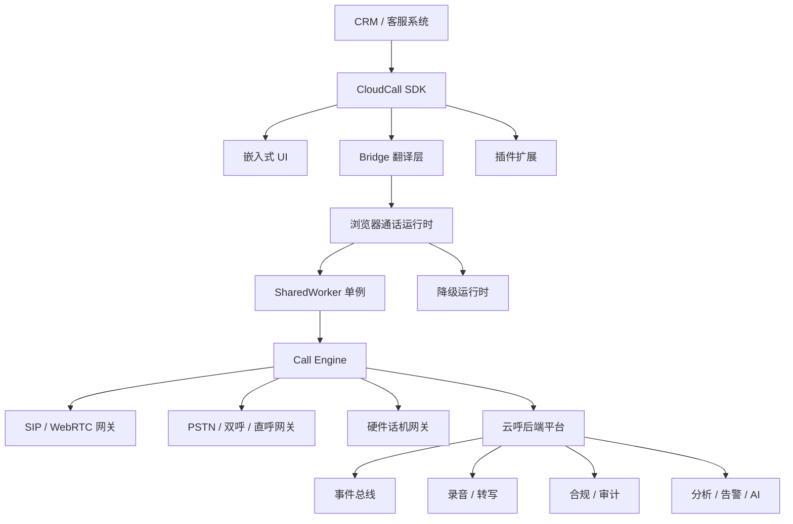
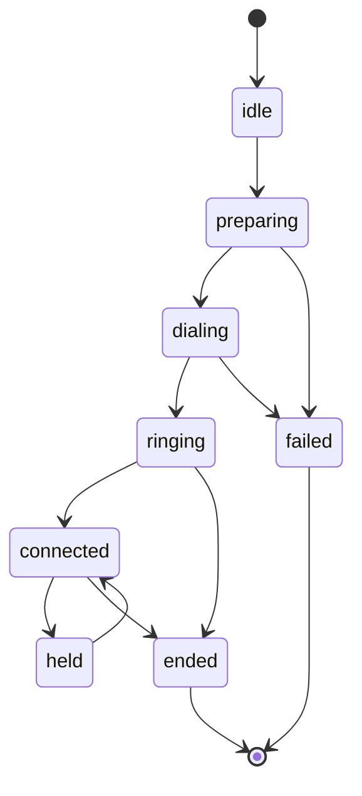
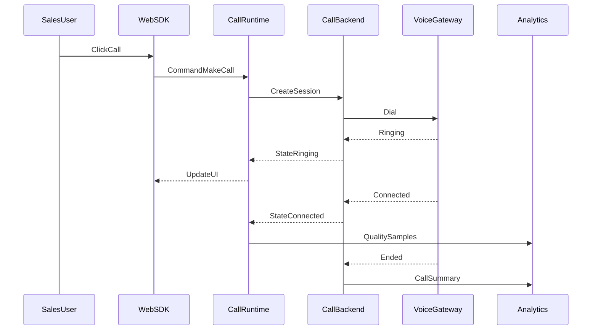

# 新云呼项目设计计划

> **文档用法：** 这篇不是介绍“已有项目”，而是回答面试官追问：如果重新设计一个更好的云呼项目，你会怎么设计？

---

## 面试回答（2～3 分钟）

如果让我重新设计一个新的云呼项目，我不会只做一个浏览器拨号盘，而会把它设计成一个**可嵌入 CRM 的轻量联络中心底座**。

它的目标有四个：

- 销售不用切系统，在 CRM 里点客户就能打。
- 主管能看到团队实时通话、通话质量、接通率和质检结果。
- 研发接入简单，SDK API 稳定，状态可恢复，问题可追踪。
- 企业侧能满足录音、权限、审计、频控、数据留存等合规要求。

对标市面上的产品，我会这样取长补短：

- **Twilio** 强在 WebRTC SDK、可编程能力和通话质量洞察。
- **Amazon Connect / Genesys** 强在完整联络中心、主管工作台、质检、AI 和运营分析。
- **Aircall** 强在销售团队体验，CRM 集成、Power Dialer、AI 摘要、自动回填做得好。
- **声网这类 RTC 平台** 强在通话前检测、通话中质量回调、Call Inspector 和实时告警。

所以我的设计会是：

```text
CRM 页面
  ↓
嵌入式 SDK（拨号盘、通话卡片、任务入口）
  ↓
Bridge（页面和电话后台之间的翻译官）
  ↓
浏览器唯一通话运行时（SharedWorker / 降级运行时）
  ↓
云呼后端平台（坐席、线路、路由、录音、合规、事件流、AI）
  ↓
SIP/WebRTC 网关 + PSTN/双呼/硬件供应商
```

核心原则是：**页面只负责展示和校验，真正的电话连接、状态机、批量队列放到浏览器唯一运行时里；后端负责最终状态、录音、合规和分析。**

第一版我不会一上来做成 Genesys 那种大平台，而是先做可靠闭环：单呼、多 Tab 单例、状态机、拨前检测、质量监控、CRM 回填、基础批量外呼。后续再扩主管监听、AI 摘要、自动质检和运营看板。

30 秒压缩版：

> 我会把新云呼设计成“嵌入式联络中心底座”。前端 SDK 负责接入 CRM 和展示，Bridge 负责传指令和状态，浏览器唯一运行时负责真正通话和多 Tab 同步，后端负责路由、录音、合规、事件和 AI。第一版先保证单呼可靠、状态可恢复、质量可定位，再扩批量、AI、质检和主管能力。

---

## 竞品对标

### 能从竞品学什么

| 产品 | 最值得学的点 | 我会怎么吸收 |
| --- | --- | --- |
| Twilio Voice SDK | 可编程语音、WebRTC API override、Voice Insights、服务端录音 | SDK 设计成强 API，不把能力写死在 UI 里；内建质量洞察 |
| Amazon Connect | 坐席工作台、实时分析、第三方应用 iframe 集成、Contact Lens | 做主管看板、坐席工作台和可嵌入工作流 |
| Genesys Cloud CX | 全渠道路由、质检、排班、AI Copilot、旅程分析 | 中长期扩展成运营平台，不止拨号 |
| Aircall | CRM 原生集成、Power Dialer、监听/耳语、AI 摘要、自动回填 | 先把销售使用体验和 CRM 自动化做好 |
| 声网 / RTC 平台 | 通话前检测、通话中质量指标、Call Inspector、实时告警 | 质量监控从第一版内建，不等线上出问题再补 |

### 我的差异化定位

不直接照搬大联络中心，而是做一个更适合 CRM 场景的产品：

- 比 Twilio 更“业务化”：不是只给 API，还给拨号盘、任务、CRM 回填和销售工作流。
- 比 Amazon / Genesys 更“轻”：先嵌入现有 CRM，不要求客户迁移到完整坐席平台。
- 比 Aircall 更“可定制”：前端 SDK、插件、事件、供应商抽象都开放。
- 比传统云呼更“可观测”：每一通电话能看到状态、信令、质量、用户操作和后端事件。

---

## 总体架构



### 分层职责

| 层 | 做什么 | 不做什么 |
| --- | --- | --- |
| CRM 宿主 | 提供客户、线索、商机上下文 | 不直接操作 SIP |
| SDK UI | 拨号盘、通话卡片、任务入口、错误提示 | 不写复杂协议逻辑 |
| Bridge | 传指令、同步状态、隔离宿主和运行时 | 不负责真正打电话 |
| 浏览器运行时 | 保持唯一电话实例、多 Tab 同步、状态机、批量队列 | 不做最终合规决策 |
| 后端平台 | 坐席、线路、路由、录音、合规、事件、AI | 不依赖前端状态作为最终真相 |
| 语音网关 | SIP/WebRTC/PSTN/硬件供应商接入 | 不暴露供应商差异给业务层 |

### 核心设计原则

- **页面和通话分离**：React 组件不直接持有底层通话对象。
- **浏览器内单例**：同一个浏览器只允许一份通话运行时。
- **指令和状态分离**：拨打/挂断是指令，响铃/接通是状态。
- **后端最终态**：前端状态可恢复、可展示，但后端事件是最终事实。
- **可观测性内建**：每通电话从点击到挂断都能回放链路。
- **供应商可替换**：SIP、双呼、硬件、运营商能力走统一 Provider 接口。

---

## 前端 SDK 设计

### 外部 API

SDK 分成三类 API：

| API 类型 | 用途 | 示例 |
| --- | --- | --- |
| 业务 API | 给 CRM 快速调用 | `makeCall`、`openDialer`、`startBatchCall` |
| 生命周期 API | 初始化、销毁、刷新权限、切租户 | `init`、`destroy`、`refreshToken` |
| 插件 API | 替换 UI、挂载 AI 卡片、接入业务组件 | `registerSlot`、`registerPlugin` |

示例：

```ts
const sdk = await CloudCallSDK.init({
  tenantId,
  userId,
  container,
  tokenProvider,
  modules: ['dialer', 'batch-call', 'ai-summary'],
});

sdk.phone.makeCall({
  number,
  contactId,
  scene: 'crm_customer_detail',
});
```

### Headless SDK + UI Kit

我会把 SDK 拆成两层：

- **Headless SDK**：只提供状态、命令、事件，不绑定 React。
- **UI Kit**：提供默认拨号盘、通话卡片、任务面板。

这样：

- 普通客户直接用 UI Kit，快速接入。
- 大客户可以自定义 UI，只复用底层通话能力。
- React、Vue、原生页面都能接。

### Bridge 协议

Bridge 不传内部对象，只传标准消息：

```ts
type SDKMessage = {
  version: 'v1';
  requestId: string;
  tabId: string;
  type: 'command' | 'state' | 'event' | 'lifecycle';
  name: string;
  payload: unknown;
  timestamp: number;
};
```

关键点：

- `version`：后续协议升级不破坏老宿主。
- `requestId`：一通请求能串起前端、运行时、后端日志。
- `command`：需要 ack、timeout、retry。
- `state`：必须幂等，重复应用不会出错。
- `event`：用于埋点、审计和不可逆行为。

---

## 浏览器通话运行时

### 为什么需要运行时

如果把通话对象放在 React 组件里，会有几个问题：

- 多 Tab 重复注册。
- 页面刷新状态丢失。
- 组件卸载可能误挂断。
- 批量队列和通话连接耦合 UI 生命周期。

所以需要一个独立运行时，像“浏览器里的电话后台”。

### 运行时职责

- SIP 注册和心跳。
- WebRTC 连接和设备绑定。
- 多 Tab 状态同步。
- 单通状态机。
- 批量外呼队列。
- 断线恢复。
- 质量采集。
- 本地状态快照。

### 运行时选型

| 方案 | 优点 | 风险 | 用法 |
| --- | --- | --- | --- |
| SharedWorker | 多 Tab 天然共享 | Safari / 钉钉兼容要处理 | 优先方案 |
| Dedicated Worker | 线程隔离 | 多 Tab 不共享 | 单页或降级 |
| Service Worker | 生命周期独立 | 无 DOM、媒体权限受限 | 不适合作为主通话运行时 |
| iframe 模拟运行时 | 兼容性好 | 跨 Tab 能力弱 | 降级方案 |

---

## 通话核心设计

### 统一 Call Session

不管是云呼、硬件、双呼、直呼，都抽象成 `CallSession`。



每个 `CallSession` 必须包含：

- 全局 `callId`
- 本地 `sessionId`
- 租户、坐席、客户、场景
- 当前状态、前一个状态
- 状态变更原因
- 通话类型：云呼 / 硬件 / 双呼 / 直呼
- 质量指标
- 录音和转写关联 ID
- 合规标记

### 状态推进规则

- 状态只能向前推进。
- 结束态不可重新激活。
- 每次状态变化记录来源：用户操作、SIP 事件、后端回调、供应商回调。
- 前端和后端冲突时，以后端最终态为准。
- 所有状态变化都发事件，便于回放。

### 断线恢复

| 场景 | 策略 |
| --- | --- |
| 信令 WebSocket 断开 | 短时间自动重连，期间 UI 显示重连中 |
| 媒体 ICE 失败 | 尝试 ICE restart，同时提示网络异常 |
| 页面刷新 | 新页面从运行时恢复当前 session |
| 所有 Tab 关闭 | 后端兜底释放通话，前端下次进入展示最终态 |
| 网关回调延迟 | 前端先显示本地态，最终以后端事件修正 |

---

## 批量外呼设计

批量外呼不是前端 for 循环，而是任务系统。

### 任务模型

| 对象 | 含义 |
| --- | --- |
| Campaign | 一次批量外呼任务 |
| ContactItem | 一个待拨联系人 |
| Attempt | 对某个联系人一次拨打尝试 |
| Policy | 间隔、重试、失败跳过、合规规则 |

### 执行模式

- **串行模式**：一通挂断再下一通，适合人工销售。
- **半自动模式**：下一通前等待销售确认。
- **自动模式**：符合规则自动推进。
- **预览模式**：先展示客户资料，再由销售点击拨打。

### 控制策略

- 云呼 / 硬件默认有冷却间隔。
- 失败原因分类：忙线、拒接、空号、线路错误、合规拦截。
- 致命错误熔断：线路暂停、坐席异常、并发超限。
- 任务可暂停、恢复、取消。
- 批量结果可回写 CRM。

---

## WebRTC 与音频质量

### 拨前检测

正式发起云呼前先做检测：

- 浏览器是否支持 WebRTC。
- 是否 HTTPS。
- 麦克风权限。
- 输入/输出设备可用性。
- 回声测试。
- 网络探测：RTT、丢包、抖动。

这样能把“点了拨号才发现没麦克风”的问题提前暴露。

### 通话中采集

每 2 秒采集：

- RTT
- 上行/下行丢包
- jitter
- audio level
- bitrate
- ICE 状态
- 设备变化
- WebSocket 状态

### 用户提示

- 麦克风不可用：引导打开权限。
- 网络差：提示但防抖，避免一直弹。
- 长时间静默：提醒检查耳麦。
- 设备切换：自动重绑或提示选择。

### Call Inspector

每一通电话都能打开一张“排障时间线”：

- 用户点击时间。
- 拨前检测结果。
- SIP 注册/呼叫时间。
- 响铃、接通、挂断时间。
- ICE 状态变化。
- 网络质量曲线。
- 后端回调和供应商错误码。

---

## CRM 集成设计

### 接入方式

- JS SDK 嵌入。
- iframe 嵌入。
- Web Component 嵌入。
- React / Vue Adapter。
- 后端 Webhook。

### 自动化

- 自动创建通话记录。
- 自动关联客户、线索、商机。
- 自动写跟进。
- 自动生成下一步任务。
- 自动回填 AI 摘要、关键词、情绪、标签。
- 支持 Salesforce、HubSpot、Zendesk 这类标准 CRM，也支持私有 CRM 适配。

### 插件能力

允许宿主替换：

- 号码筛选面板。
- 通话后总结页。
- AI 提示卡片。
- 客户画像卡片。
- 质检结果卡片。

插件必须沙箱化，避免宿主业务代码影响通话主链路。

---

## AI 能力设计

AI 不能只是“通话后生成一段摘要”，应该嵌进工作流。

### 通话中 AI

- 实时转写。
- 关键词提醒。
- 异议处理话术。
- 知识库推荐。
- 违规话术提醒。
- 主管实时辅助。

### 通话后 AI

- 自动摘要。
- 客户意向识别。
- 下一步行动建议。
- CRM 字段自动回填。
- 自动生成跟进邮件/短信。
- 自动质检评分。

### AI 风险控制

- AI 建议不能直接替代销售承诺。
- 敏感词、违规话术和 AI 输出要可追溯。
- 转写、摘要、录音按租户设置留存时间。
- 支持按租户、角色、场景关闭 AI。

---

## 后端平台设计

### 核心服务

| 服务 | 职责 |
| --- | --- |
| Auth Service | 租户、用户、权限、token |
| Agent Service | 坐席、在线状态、线路绑定 |
| Call Orchestrator | 呼叫编排、路由、会话状态 |
| SIP Gateway | SIP / WebRTC 网关 |
| PSTN Gateway | 双呼、直呼、硬件话机 |
| Recording Service | 录音、双声道、存储、回调 |
| Transcript Service | 转写、摘要、关键词 |
| Analytics Service | 指标、报表、告警 |
| Compliance Service | 黑名单、频控、审计 |

### 事件总线

所有关键动作都发事件：

```text
call.created
call.dialing
call.ringing
call.connected
call.ended
call.failed
recording.ready
transcript.ready
quality.degraded
compliance.blocked
```

前端、报表、AI、CRM 同步都消费事件，避免服务之间直接互相调用。

### 数据对象

- Tenant：租户
- User：用户
- Agent：坐席
- Line：线路
- Device：设备
- CallSession：单通会话
- Campaign：批量任务
- Recording：录音
- Transcript：转写
- QualitySample：质量采样
- AuditLog：审计日志

---

## 安全与合规

### 权限

- 谁能拨号。
- 谁能听录音。
- 谁能导出数据。
- 谁能监听、耳语、强插。
- 谁能看 AI 摘要和质检。

### 数据保护

- 号码脱敏。
- 录音加密。
- 转写加密。
- 多租户隔离。
- 审计日志不可篡改。
- 数据留存策略可配置。

### 合规策略

- DNC 黑名单。
- 频率限制。
- 地区限制。
- 工作时间限制。
- 明示录音提示。
- 主管操作审计。

---

## 可观测性

我会把可观测性分成四层：

| 层 | 看什么 |
| --- | --- |
| 用户体验 | 能不能打、多久接通、有没有声音 |
| 通话质量 | RTT、丢包、jitter、静默、设备切换 |
| 系统质量 | SIP 注册成功率、网关错误、API 延迟、事件积压 |
| 业务质量 | 接通率、有效通话率、转化率、批量完成率 |

单通电话链路：



---

## 技术选型

### 前端

前端我会优先选择 **React + TypeScript + Headless SDK + UI Kit** 的组合。

这里的重点不是“用 React 做页面”，而是把产品拆成两层：

- **Headless SDK**：不关心 UI，只提供初始化、通话命令、状态订阅、事件回调。
- **React UI Kit**：基于 Headless SDK 做默认拨号盘、通话卡片、批量外呼面板、AI 摘要面板。

这样普通客户可以直接用 UI Kit，大客户也可以只接 Headless SDK，自己画 UI。

#### React 技术选型总览

| 方向 | 选择 | 原因 |
| --- | --- | --- |
| 基础框架 | React 18 + TypeScript | 生态成熟，适合复杂交互和嵌入式组件 |
| SDK 核心 | Headless SDK | 让通话能力和 UI 解耦，便于 React/Vue/原生接入 |
| UI 层 | React UI Kit | 提供默认拨号盘、通话卡片、任务面板 |
| 全局 UI 状态 | Zustand | 轻量、无 Provider 嵌套，适合 SDK 内部状态 |
| 服务端数据 | TanStack Query | 管接口缓存、重试、失效刷新，适合坐席/线路/配置 |
| 复杂表单 | React Hook Form + Zod | 拨号配置、任务配置、插件配置需要强校验 |
| 组件样式 | CSS Modules / Vanilla Extract | 避免污染宿主 CRM 样式 |
| 弹层挂载 | Portal + Shadow DOM 可选 | 避免被宿主页面样式和 z-index 影响 |
| 打包 | Vite + tsup / Rollup | 同时产出 ESM、CJS、UMD，适合 npm 和 script 接入 |
| 测试 | Vitest + Testing Library + Playwright | 单测状态逻辑，端到端测拨号流程 |
| 可观测性 | SDK 内置 logger + OpenTelemetry bridge | 通话链路和前端异常可追踪 |

#### 为什么状态管理选 Zustand

通话 SDK 的前端状态分两类：

- **界面状态**：拨号盘开关、当前输入号码、弹窗、选择线路。
- **通话状态**：响铃、接通、挂断、批量进度、质量告警。

我不会把所有状态都放进 React Context，因为通话状态变化频繁，Context 容易造成大面积重渲染。

Zustand 的好处是：

- API 简单，SDK 使用方不需要理解 Redux。
- 可以按 selector 订阅局部状态，减少重渲染。
- 不依赖 React Provider，适合被嵌入不同宿主页面。
- Headless SDK 和 UI Kit 都能复用同一套 store。

Redux Toolkit 适合更大的业务后台，但对一个嵌入式 SDK 来说偏重。除非后续要做完整坐席工作台，否则 MVP 不优先选 Redux。

#### 为什么接口层选 TanStack Query

云呼 SDK 里有很多“远端配置类数据”：

- 坐席信息
- 线路列表
- 企业权限
- 任务配置
- 合规策略
- AI 开关

这些数据适合用 TanStack Query 管理：

- 自动缓存，避免每个组件重复请求。
- token 刷新后可以统一失效重拉。
- 接口失败可以重试或降级。
- 页面重新聚焦时可按需刷新坐席状态。

但通话中的实时状态不放 TanStack Query，而走 Bridge / Runtime 的状态订阅，因为它不是普通 HTTP 数据。

#### 组件设计

React 组件分成三层：

```text
CloudCallProvider
  ↓
业务容器组件（DialerContainer / CallPanelContainer / BatchCallContainer）
  ↓
纯 UI 组件（Button / LineSelector / CallTimer / QualityBadge）
```

设计原则：

- 容器组件接 SDK 状态和命令。
- 纯 UI 组件只收 props，不知道通话协议。
- 所有弹层用 Portal 挂到 SDK 自己的 root。
- 样式前缀隔离，避免污染 CRM。
- 高风险组件（通话卡片、挂断按钮）减少外部覆盖能力。

#### 嵌入式 SDK 的样式隔离

这是 React 云呼 SDK 很关键的一点。

普通后台项目可以全局 CSS，但 SDK 是嵌到别人页面里的，必须防止：

- 宿主的 `button`、`div`、`antd` 样式影响 SDK。
- SDK 的样式污染宿主 CRM。
- 弹层被宿主 z-index 盖住。

我会这样做：

- 默认 CSS Modules + 统一 class 前缀。
- 弹层统一挂到 SDK root。
- 大客户场景支持 Shadow DOM 模式。
- 主题通过 CSS Variables 暴露，不让宿主直接改内部 class。

#### React 性能策略

云呼场景有几个高频更新点：通话计时、质量指标、批量倒计时。

处理方式：

- 通话计时不每秒改全局大 store，只让计时组件局部更新。
- 质量指标先在运行时聚合，再低频推 UI。
- 批量倒计时只更新对应面板，不刷新整个拨号盘。
- 状态订阅用 selector，避免无关组件重渲染。
- 大列表（批量联系人）用虚拟列表。

#### SDK 打包和接入方式

需要同时支持三种客户：

| 客户类型 | 接入方式 |
| --- | --- |
| 现代前端项目 | npm 包：`@cloud-call/sdk`、`@cloud-call/react` |
| 老 CRM / 后端模板 | script 标签 UMD：`window.CloudCallSDK` |
| 大客户私有化 | 可配置静态资源域名和后端 API 域名 |

包结构：

```text
@cloud-call/core        Headless SDK，不依赖 React
@cloud-call/react       React Hooks + UI Kit
@cloud-call/runtime     SharedWorker / iframe runtime
@cloud-call/types       公共类型
```

#### React Hooks 设计

React 层提供少量稳定 Hooks：

```ts
const { makeCall, hangup, answer } = useCloudCallActions();
const call = useCurrentCall();
const quality = useCallQuality();
const batch = useBatchCallState();
const lines = useAvailableLines();
```

Hooks 只暴露业务语义，不暴露底层 SIP 对象。

#### 不优先选择的方案

| 方案 | 不优先原因 |
| --- | --- |
| Next.js | SDK 是嵌入式组件，不是完整站点；SSR 意义不大 |
| 大量 Context | 高频通话状态会导致不必要重渲染 |
| Redux 全家桶 | 对 SDK MVP 偏重，除非做完整坐席后台 |
| 全局 CSS / Less 全局覆盖 | 容易污染宿主 CRM |
| 只做 React SDK | 会限制 Vue/原生系统接入，所以核心必须 Headless |

#### 面试口述版

> React 技术选型我会拆成 Headless SDK 和 React UI Kit。真正的通话能力放在不依赖 React 的 core 里，React 只负责默认拨号盘、通话卡片和任务面板。状态管理用 Zustand，因为轻量、可按 selector 订阅，适合嵌入式 SDK；接口数据用 TanStack Query，通话实时状态走 Bridge 订阅。样式用 CSS Modules 或 Shadow DOM 隔离，避免污染宿主 CRM。打包上同时产出 npm 包和 script UMD，兼容现代前端和老系统。

### 后端

- Node.js / Go 做实时 API。
- Kafka / Pulsar 做事件总线。
- Redis 做坐席状态、频控、分布式锁。
- PostgreSQL 做业务数据。
- ClickHouse 做指标和埋点。
- 对象存储做录音、转写文件。
- OpenTelemetry 做链路追踪。

### 网关

- SIP/WebRTC 网关可自研或基于成熟网关二次封装。
- PSTN/运营商能力走供应商抽象层。
- 所有供应商通过统一 `VoiceProvider` 接口接入。

---

## MVP 范围

第一版不要一上来做成 Genesys，先保证可靠闭环。

### 必做

- 单呼：云呼 + 双呼至少一种可用。
- 嵌入式拨号盘。
- 多 Tab 单例。
- 通话状态机。
- 拨前检测。
- 通话记录。
- 基础录音。
- 质量采样。
- CRM 回填。
- 基础批量外呼。
- 基础权限和审计。

### 暂缓

- 全渠道客服。
- 完整排班。
- 高级预测路由。
- 复杂 AI Copilot。
- 完整质检中心。
- 大规模 BI 自助分析。

---

## 里程碑

### 第 1 阶段：基础云呼 SDK

目标：稳定嵌入 CRM，完成单呼闭环。

交付：

- SDK 初始化。
- 拨号盘。
- 单通状态机。
- Bridge 协议。
- 多 Tab 单例。
- 云呼/双呼之一。
- 通话记录。

### 第 2 阶段：可靠性和可观测性

目标：线上问题能定位。

交付：

- 拨前检测。
- WebRTC 质量采样。
- Call Inspector。
- 断线恢复。
- 失败分类。
- 实时告警。

### 第 3 阶段：销售效率

目标：销售少填表、多打有效电话。

交付：

- 批量外呼。
- CRM 自动回填。
- 通话后总结。
- 号码合规预筛。
- 任务队列。

### 第 4 阶段：管理和 AI

目标：主管可管控，组织可复盘。

交付：

- 实时监听、耳语、强插。
- 自动转写。
- AI 摘要。
- 自动质检。
- 主管看板。
- 团队指标。

---

## 设计取舍

- **不一开始做全渠道**：先把语音做好，避免范围失控。
- **不把通话协议塞进 React 组件**：降低 UI 和通话状态耦合。
- **不只依赖前端状态**：最终态以后端事件为准。
- **不只做日志**：要做能定位单通电话的 Call Inspector。
- **不把 AI 当外挂**：AI 要进入通话中和通话后的工作流。
- **不和某个供应商强绑定**：通过 Provider 抽象保留替换空间。

---

## 面试口述版

如果面试官问“如果重新设计，你会怎么做”，可以这样答：

> 我会把它设计成一个嵌入式联络中心底座，而不是单纯的拨号 SDK。前端页面只负责展示和校验，真正通话能力放在浏览器唯一运行时里，通过 Bridge 传指令和状态。后端统一处理坐席、线路、路由、录音、合规、事件流和 AI。
>
> 对标 Twilio，我会把 WebRTC 和质量洞察做好；对标 Aircall，我会把 CRM 集成、自动回填、批量外呼做好；对标 Amazon Connect 和 Genesys，我会补主管工作台、实时分析、质检和 AI。第一版先做单呼、多 Tab 单例、状态机、质量监控和 CRM 回填，后面再扩 AI Copilot 和质检中心。

## 相关链接

- [云呼 SDK](/md/面试准备/项目与架构/云呼SDK.md)
- [WebRTC 会议室项目](/md/面试准备/项目与架构/WebRTC%20会议室项目.md)
- [网络与安全](/md/面试准备/技术/网络与安全.md)
